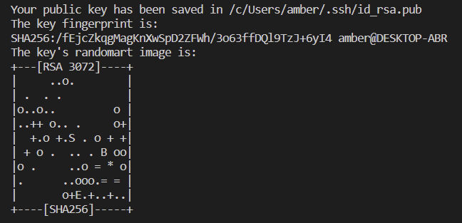
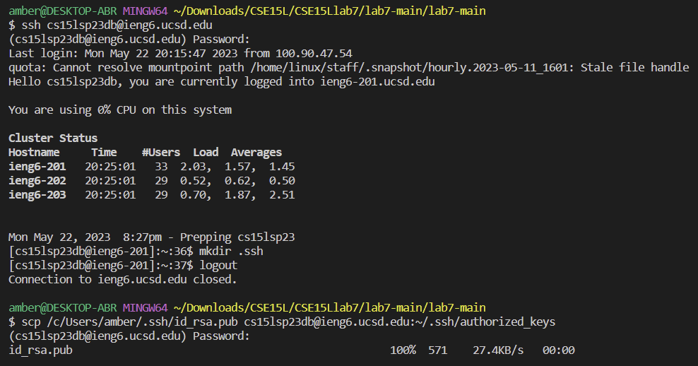
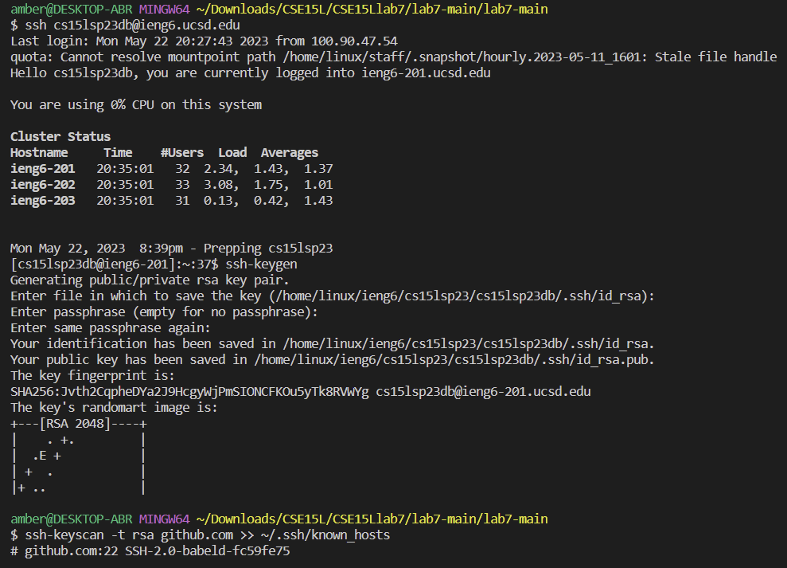
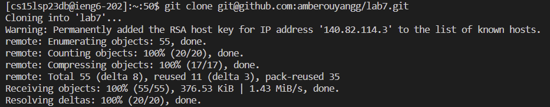
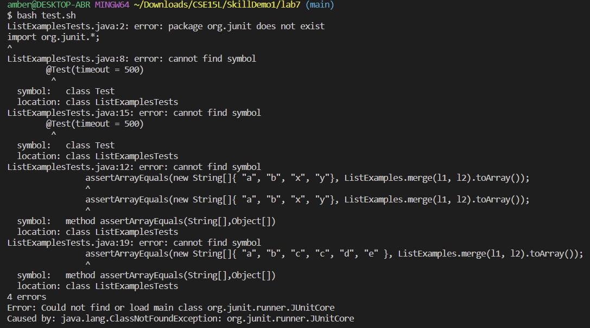
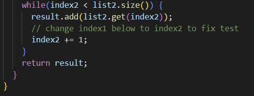
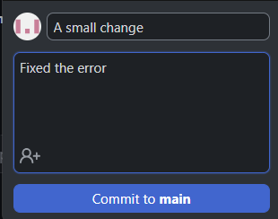
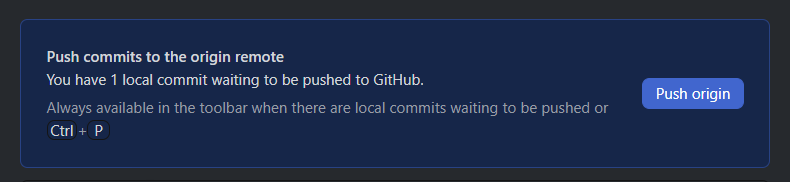

## Log into ieng6
```
Keys Pressed:
ssh-keygen <enter><enter><enter><enter> 
ssh cs15lsp23db@ieng6.ucsd.edu <enter> (password) <enter> 
mkdir .ssh <enter> 
ctrl+d (To logout) 
<right click> -> /c/Users/amber/.ssh/id_rsa.pub cs15lsp23db@ieng6.ucsd.edu:~/.ssh/authorized_keys (copies)
scp <right click> <enter> 
(password) <enter> (now you don't need to type your password again)
```


## Clone your fork of the repository from your Github account
### Cloning Pt1.
The following commands are supposed to allow you to log into ieng6 without entering your password in every time.
```
Keys Pressed: 
ssh-keygen <enter><enter><enter><enter>
<right click> -> /home/linux/ieng6/cs15lsp23/cs15lsp23db/.ssh/id_rsa.pub (copies)
cat <right click> <enter>
(Go to settings -> SHH and GPG keys -> Add SSH key -> enter then confirm: ssh-rsa AAAAB3NzaC1yc2EAAAADAQABAAABAQC8jBpVr54hT9cEkrn/txeTLsOv+UXHZCtLR2dhZJSbyRZGYuwJOC8symJw7ozGuLXuOAqk7kbhTrcqYiY1EOz3Yp95HadJ1c0nCQVLlmuhDmTr+gWI3MI/zztLC9HI0pNPao5L/YlP9XdirUsjIZZzj0Vn+BiPJqjslvhRvIA1/otAMWZBQPmzcbUYGWNEfM4LtmrYlGHf6EFHpa9ZrlRaTLTo5oY83VoDO03GYfy0fYrppmurpBcvGj+AHTdmvoAu4sD3QrDY9tslhKzs5dhWydlsGfNIgAT9JzlBKFpJihoCYVR9GBZ5oyaXB4VrOxh9fAny9qCqpYA0zBe3Za8z cs15lsp23db@ieng6-201.ucsd.edu)
ssh-keyscan -t rsa github.com >> ~/.ssh/known_hosts <enter>
ssh -T git@github.com <enter> (to check authentication)
```

### Cloning Pt2.
The following commands are supposed to clone.
```
Keys Pressed: 
git clone <ctrl+v> git@github.com:amberouyangg/lab7.git <enter>
git add . <enter>
git commit -m "small change" <enter>
git push origin master <enter>
```

## Run the tests, demonstrating that they fail
```
Keys Pressed: 
bash test.sh <enter>
```

## Edit the code file to fix the failing test
```
Keys Pressed: 
On line 44 and <right> until after index1.
<backspace> 2
```

## Run the tests, demonstrating that they now succeed
```
Keys Pressed: 
bash test.sh <enter>
```

## Commit and push the resulting change to your Github account
```
Keys Pressed: 
Commit to main <click>
Push to origin <click>
```


